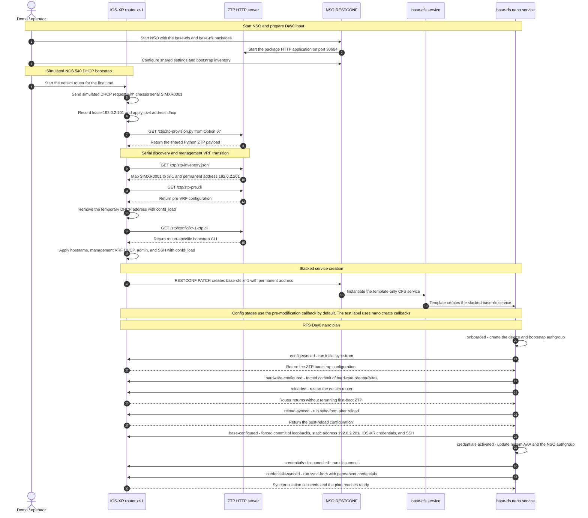

Stacked ZTP Base Configuration Services
=======================================

This example demonstrates staged zero-touch provisioning and Day0 base
configuration for four simulated Cisco IOS-XR routers. One NSO instance hosts
two explicitly stacked service packages:

```text
router call-home -> base-cfs -> base-rfs nano service -> IOS-XR device
```

Before call-home, each netsim router also simulates the IOS-XR DHCP/ZTP boot
sequence. The simulated router identifies itself as an NCS 540 DHCP client,
receives a shared Python script URL through Option 67, and downloads and
executes that script. The script discovers the chassis serial, resolves it to
the intended hostname and permanent management address, and downloads the
router-specific initial CLI configuration.

`base-cfs` is a template-only customer-facing service. It accepts the
northbound call-home input and creates one `base-rfs` service instance by
following the device leafref into the bootstrap inventory. `base-rfs` is the
Python-based resource-facing service: it performs device onboarding, drives
the nano plan, and renders all device configuration.

The `base-cfs` package also contains an auxiliary Python application that
serves the ZTP payload and CLI files on `127.0.0.1:30604`. It does not register
a service callback; the CFS service itself remains template-only. NSO starts
and stops the HTTP server with the package application lifecycle.

The RFS behavior tree invokes the built-in NSO device `sync-from` and
`disconnect` actions directly. Only the simulated hardware reload requires a
custom Python action.

Single-Router Onboarding Sequence
---------------------------------

The following sequence follows `xr-1` through DHCP/ZTP, RESTCONF call-home,
the template-only CFS, and every RFS nano-plan stage. The HTTP application,
RESTCONF endpoint, and both stacked services all run in the same NSO instance.



Device Configuration Ownership
------------------------------

By default, `base-rfs` renders each configuration stage from its
`pre_modification()` callback. The resulting device configuration is
intentionally not FASTMAP-owned and remains on the router if the service is
deleted. This models base configuration that should outlive its provisioning
service and allows other services to delete overlapping configuration.

For testing, the RESTCONF call-home transaction can use the commit label
`create-callback-apply`. In that mode, the nano service renders device
configuration from its `create()` callbacks, so NSO records normal RFS service
metadata and FASTMAP ownership. Device and authgroup onboarding remains in
`pre_modification()` in both modes.

Provisioning Flow
-----------------

1. The demo uses `make start-nso` to start NSO with both service packages. The
   `base-cfs` package application starts the ZTP HTTP provisioning server.
2. The demo configures the shared Day0 settings and bootstrap inventory through
   the NSO CLI. It supplies only mandatory secrets; the other shared settings
   use their YANG defaults.
3. `make start-netsim` starts all four routers after NSO and the provisioning
   server are ready.
4. Each router sends a simulated NCS 540 DHCP request with an EFI ARM64 vendor
   class, product identifier, `xr-config` user class, and chassis serial as its
   client identifier.
5. DHCP assigns a temporary address and returns the shared
   `http://127.0.0.1:30604/ztp/ztp-provision.py` Option 67 URL. The simulator
   applies `ipv4 address dhcp` before downloading the payload.
6. The downloaded script fetches `ztp-inventory.json` and maps the chassis
   serial to a hostname and a different, permanent management address.
7. As on a physical router, the script first removes the temporary DHCP address
   so the interface can move to the management VRF. It then downloads
   `/ztp/config/xr-N-ztp.cli` and reapplies DHCP in that VRF. `confd_load`
   represents and simulates the IOS-XR `xrapply` configuration step.
8. The script creates a `base-cfs` instance through the NSO RESTCONF API using
   the permanent management address.
9. The CFS template creates a `base-rfs` instance on the same NSO node.
10. The RFS nano plan onboards and syncs the router, applies hardware settings,
   reloads and resynchronizes it, and applies the remaining base configuration.
11. The RFS replaces DHCP with the permanent static management address, replaces
   the bootstrap `admin` credential with `nso`, disconnects,
   and completes a final sync using the permanent credential.

Netsim does not implement the IOS-XR DHCP client or ZTP agent. The example
therefore simulates the DHCP response from `device-config/dhcp-leases.json`.
The file models an `isc-dhcp-server` NCS 540 class matching
`PXEClient:Arch:00009`, `PID:N540`, and the `xr-config` user class. The Option
67 script, serial inventory, pre-VRF configuration, and router configuration
are transferred through real HTTP requests. Every downloaded artifact is
saved in the router's `logs` directory.

The IOS-XR netsim model's top-level `aaa` command collides with ConfD's local
AAA CLI tree. The example therefore performs the credential and authorization
handoff in the simulated device's enforced ConfD AAA database instead of
rendering a duplicate IOS-XR `aaa` stanza.

The four routers are named `xr-1` through `xr-4` and use synthetic chassis
serials `SIMXR0001` through `SIMXR0004`. Their temporary DHCP addresses are
`192.0.2.101` through `192.0.2.104`; their permanent management addresses are
`192.0.2.201` through `192.0.2.204`. Documentation prefix addresses are used
throughout.

`ncs-netsim` generates each simulated router's SSH host keys when it creates
the device. This represents the crypto-key generation normally performed by
the IOS-XR ZTP bootstrap before SSH is enabled.

Running The Example
-------------------

Source an NSO environment, then run:

```sh
make demo
```

The demo creates the runtime environment, starts NSO and all routers, waits for
every nano plan to reach `ready`, and prints the DHCP/Option 67 exchange, HTTP
downloads, call-home requests, CFS-to-RFS service metadata, plans, and
resulting IOS-XR base configuration.

After verification, the script pauses before stopping NSO and the netsim
routers and cleaning the generated runtime files. Press ENTER to clean up, or
press Ctrl-C to leave the example running.

To skip both the pause and automatic cleanup, for example when running the
demo from an automated test:

```sh
NONINTERACTIVE=1 make demo
```

To exercise the FASTMAP-owned test path instead:

```sh
CREATE_CALLBACK_APPLY=1 make demo
```

The demo passes `label=create-callback-apply` on each router's RESTCONF
call-home request and verifies that the resulting device configuration carries
RFS service metadata. The default invocation verifies that this metadata is
absent.

When cleanup was skipped, inspect the running example with:

```sh
make cli
make status
make stop
make clean
```

NSO uses the IPC socket `/tmp/nso/ztp-base-config-ipc`; RESTCONF listens on port
`8180`, and the ZTP HTTP server listens on port `30604`. Router CLI ports start
at `21022`, keeping the example independent of other netsim topologies using
the default ports. The example uses the `cisco-iosxr-netsim-cli-1.0` NED.

Service Packages
----------------

- `packages/base-cfs` defines the template-only northbound service and stacking
  template, plus the independently managed ZTP HTTP server application.
- `packages/base-rfs` defines the resource-facing nano service, its plan and
  actions, and the IOS-XR configuration templates.
- `device-config/dhcp-leases.json` represents the DHCP server, NCS 540 client
  class, synthetic chassis identities, temporary leases, and shared Option 67
  assignment.
- `device-config/dhcp-ztp-client.py` downloads and executes the Option 67
  payload for a netsim router.
- `device-config/ztp-inventory.json` maps chassis serials to hostnames and
  permanent management addresses.
- `device-config/ztp-provision.py` is the shared downloaded IOS-XR ZTP payload.
  It performs serial discovery, the management-VRF transition, initial CLI
  application, and RESTCONF call-home.
- `device-config/ztp-pre.cli` removes the DHCP address before the interface is
  moved into the management VRF.
- `device-config/*-ztp.cli` contains the simulated DHCP/ZTP bootstrap config.
- `device-config/netsim-start.sh` launches the DHCP/ZTP simulation on first
  boot.

Further Reading
---------------

+ NSO Development Guide: Nano Services
+ The `demo.sh` script